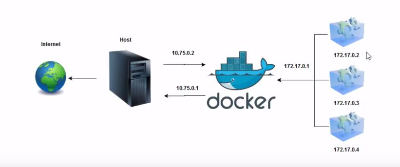

# Links

*Useful*

- [Dockerhub Explore](https://hub.docker.com/search?q=&type=image)

*Troubleshoots*

- [Limitations of Windows containers for localhost and published ports](https://docs.docker.com/docker-for-windows/troubleshoot/#limitations-of-windows-containers-for-localhost-and-published-ports)

# Notes

Como Docker funciona:



Para visualizar ip do Docker:

```
ping docker
```

Visualizar o processos atuais

```
docker ps
```

Visualizar as images

```
docker images
```

Adicionar images

```
docker pull debian
docker pull debian:14.0
docker pull ubuntu
```

Criar container

```
docker run -it --name test
cat /etc/issue
```

Para sair do container `ctrl` + `p` + `q`

Ver todas as informações do container

```
docker inspect <container-id>
```

Para parar um container

```
docker stop <container-id>
```

Para ver todos os containers mesmo que parado

```
docker ps -a
```

Para iniciar um container que esta parado

```
docker start <container-id>
```

Para entrar no container

```
docker attach <container-id>
apt-get update
# saia do docker ctrl+p+q
docker diff <container-id>
```

Criar uma imagem apartir de um container

```
docker commit -a Ricardo -m "Simple teste" <container-id> debian/minha_imagem:1.0
```

Removendo container

```
docker stop <container-id>
docker rm <container-id>
# or docker rm -f<container-id>
```

Removendo image

```
docker rmi <image-id>
```

### Cheetsheat

```bash
# Removing all containers with status 'exited'
docker rm $(docker ps -a -q -f status=exited)

# remove all stopped containers (achieve the same effect above)
docker container prune
```
