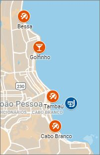
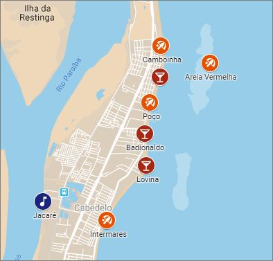
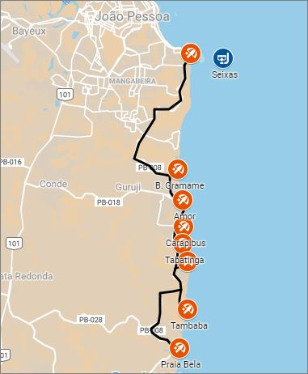

# João Pessoa

As praias do sul, por exemplo, merecem mais do que um simples passeio de um dia a todas elas; você provavelmente vai querer voltar a Coqueirinho, Barra do Gramame ou mesmo Tambaba.

As boas praias do norte também estão longe da zona hoteleira, e estar de carro dá liberdade de fazer seus horários.

Para encontrar as praias no pico da sua beleza, venha entre dezembro e março, quando o mar estará entre o azul-bebê e o verde-água.

**Tambaú e Cabo Branco**

Todas as manhãs, entre 5h e 8h, a avenida é fechada para joggers, caminhantes, ciclistas e patinadores.

Do canto esquerdo da praia -- ou seja, de Tambaú -- saem os catamarãs para as piscinas naturais de Picãozinho (e também alguns catamarãs para as piscinas naturais do Seixas).

**Bessa**

A praia do Bessa está num bairro residencial, escondida da avenida de passagem. Só o último trecho da praia, à altura do hotel Bessa Beach, tem avenidazinha beira-mar e calçadão (e mar mais agitado).

**Praias do norte**

É a praia das ondas e dos surfistas.

Passando as ondas de Intermares, o mar de Cabedelo fica calminho e, no verão, caribenho, colorido de azul-turquesa. As três praias da região -- Ponta da Campina, Poço e Camboinha, na ordem que aparecem para quem vem de João Pessoa -- são contíguas e escondidinhas, pois não há nenhuma avenida à beira-mar. Na maré baixa a areia fica dura e ótima para caminhar. É também quando emerge a ilha de Areia Vermelha, um banco de areia em frente a Camboinha

**Costa do Conde**

As agências de turismo receptivo oferecem um tour de todas as praias num dia, com parada mais prolongadas para banho em Coqueirinho e Tambaba. Bugueiros também fazem o passeio -- mas tenha em mente que irão sempre pela estrada;

## Cost

Price  | Description
-------|-----------
R$ 19  | Meal (inexpensive)
R$ 90  | Meal for 2 people (mid-range)
R$ 9   | Domestic Beer
R$ 5.6 | Cappuccino
R$ 2   | Watter (300ml)
R$ 4.5 | Taxi Start
R$ 2.2 | Taxi 1km

## Links

- [O que fazer em João Pessoa](https://www.viajenaviagem.com/destino/joao-pessoa/o-que-fazer-joao-pessoa/)

*Videos*

- [Piscinas naturais](https://www.youtube.com/watch?v=-F_100FWa3I)

[cost of living]:https://www.numbeo.com/cost-of-living/rankings_current.jsp

## Simulation

Price      | Description
-----------|-----------------------------------
R$ 950,00  | Passagem: Londrina - João Pessoa
R$ 120,00  | Diária em AirBnB
R$ 120,00  | Translado, ida e volta
